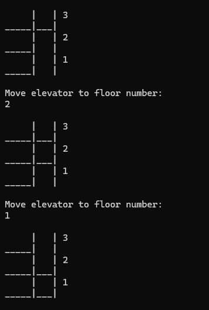

# Haskell Elevator

A visual elevator built in haskell using the terminal to visualize its movement.



## Getting started

Run project: `stack run`
Run tests: `stack test --file-watch`

## Git commit message standards

Focus on the why and not the how of the change.

[https://github.com/joelparkerhenderson/git-commit-message](https://github.com/joelparkerhenderson/git-commit-message)

## User stories

- [ ] Visualize the elevator
As a manager,
I want to see the elevator,
So that I know where it is.

	- [ ] See visualizations
	As a manager,
	I want to see visualizations in the terminal,
	So that I can see the elevator.

- [ ] Control the elevator
As a manager,
I want to tell the elevator where to move,
So that I can see it move there.

## Thoughts

### Might be terminal specific

`putStrLn "\ESC[2J\ESC[H"`

### Characters to draw with

```
          _____
__________|   |
          |   | 5
__________|   |
          |___| 4
__________|   |
          |___| 3
__________|   |
          |   | 2
__________|   |
          |   | 1
__________|   |
------------------

```

### What are all the possible states of my elevator?

Config:
	The number of floors
	(the design is unchangable)
During use:
	elevator position (at floors and in between floors)
	elevator doors opened or closed
Maybe in future
	People inside or not
	Floor button pressed (going up or down)

I want the data structure of this to be prioritized over the implimentation of the functionality.

A floor:
	Line number (position) tuple e.g (3,4)
